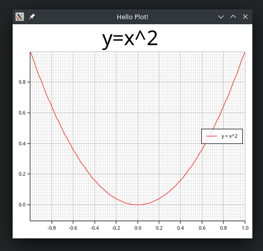
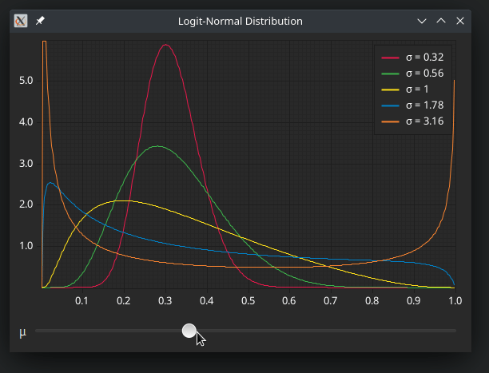

# Plotters Widget for Druid

Use [Plotters](https://crates.io/crates/plotters) to draw plots in [Druid](https://crates.io/crates/druid).

## Examples

### [Simple](examples/simple.rs)

This draws the basic plot from the plotters example, filling out the entire window. The size of the plotting area changes when resizing the window.



```bash
cargo run --example simple
```

### [Interactive](examples/interactive.rs)

In this example we use a value from the druid data to manipulate the plot.



```bash
cargo run --example interactive
```

## License

Licensed under either of

 * Apache License, Version 2.0 ([LICENSE-APACHE](LICENSE-APACHE) or http://www.apache.org/licenses/LICENSE-2.0)
 * MIT license ([LICENSE-MIT](LICENSE-MIT) or http://opensource.org/licenses/MIT)

at your option.
